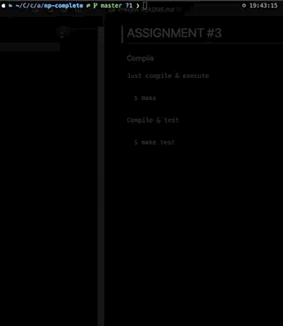

# ASSIGNMENT #3

 <p align="center">
   
 </p>


### Build
`Just compile & execute basic input.`
```shell
$ make
```

`Compile & test`
```shell
$ make test
```

------------
### How it works?

#### Overall
> Calculating hamming distance via dynamic programming <br>
> Reducing decision tree via backtracking (B&B). <br>

#### Details
I use `BFS` to solve this problem. The Q node has a lot of members. <br>

```cpp
typedef struct _node {
	struct _node *  next;
	struct _node *  prev;
	unsigned int *  dp;             // For save the former result.
	unsigned int    maxhd;          // max hamming distance
	unsigned int    minhd;
	float           average;
	int             progress;
	char *          until;
}node;
```

`uint * dp` will have `i` members (`i` line data) and use this array when calculating hamming distance. <br>
`uint maxhd` will remember the `char * until`'s max hamming distance. <br>

***Calculating hamming distance example***


When executing `BFS` our program cuts the branch through B&B <br>
The structure node has maxhd. We use this value to check the node is valid.<br>

***Cutting branch example***
> mhd : max hamming distance


Above example, At the first, the one and only `mhd : 2` branch will be cut.<br>
Then, at next calculation, four `mhd: 2` branches will be cut. <br>

Via these two, we can solve this problem in reasonable time.


-----------
### Conclusion
 * Calculating 992 (width) * 5000 (line) less than 1 seconds.
 * Calculating 64 (width) * 5000 (line) less than 0.5 seconds.

-----------
### Further improvement
> We can approximate the result when there are many kinds of characters. <br>
> In above case the program has very reasonable speed, when input has just two chars. <br>
> But other case, when whole alphabets are in input, this program will be extremely slow.<br>
> So, we must not calculate the all case. <br>

#### `Predicting` the branch.
I choose prediction to solve this problem. In this case out program does not find the exact answer. <br>
The program will predict that the branch is useless when branch does not change the result.<br>
If all branch do not change the result, the program picks the branch that have the most used character in that column. <br>

#### Results by using prediction.
 * Calculating 992 (width) * 5000 (line) less than 0.5 seconds. {input 0, 1}
 * Calculating 992 (width) * 5000 (line) less than 1 seconds. {alphabets}